# KEYCLOAK INTEGRATION WITH SPRING BOOT
Configuring keycloak as an authorization server. Follow the steps to create a realm and configure identity providers such as Google and GitHub.

## USAGE
In this project, postgres was used as the database for keycloak.
Keycloak admin credentials are username/email=`admin` and password=`password`.

#### REALM CREATION
- After keycloak is running create a realm `demo`
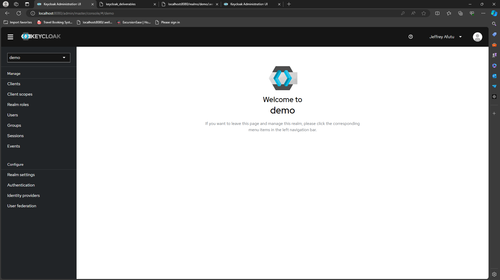
#### CLIENT CONFIGURATION
  - Create a client `spring-boot`, Valid redirect URIs `http://localhost:8765/*`, Web origins `http://localhost:8765` and ensure you have client authentication on  
  Note that the Gateway URI was used as our redirect uri and web origins. Ensure you use `http://localhost:8765/*` and `http://localhost:8765` rather than `http://localhost:8081/*` and `http://localhost:8081` as used in the screenshot.
  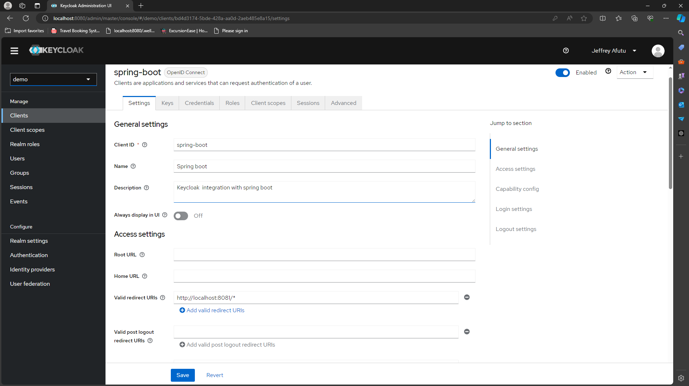
  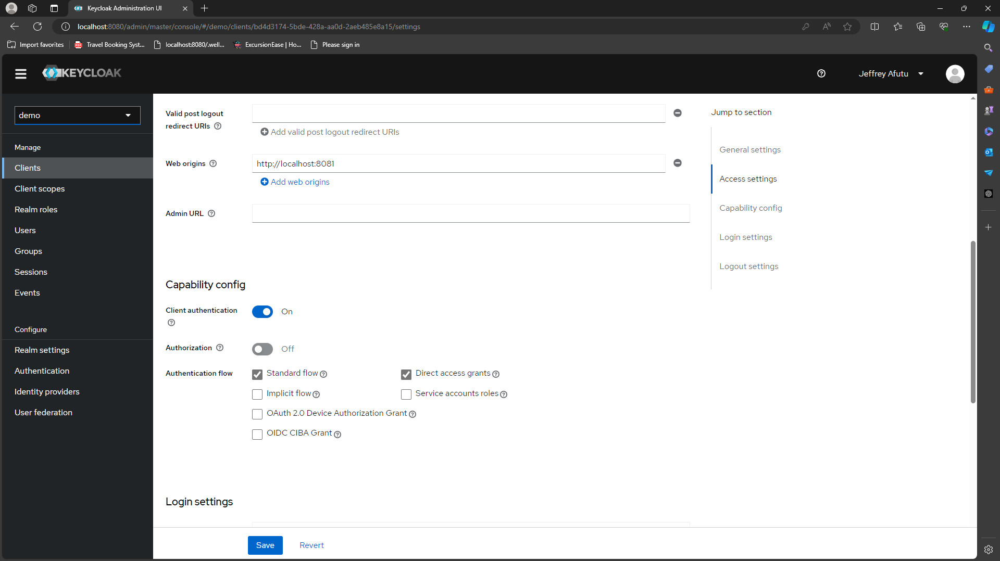
#### USER CREATION
- Create a user for authentication and authorization into the keycloak server. Ensure you enable email verified
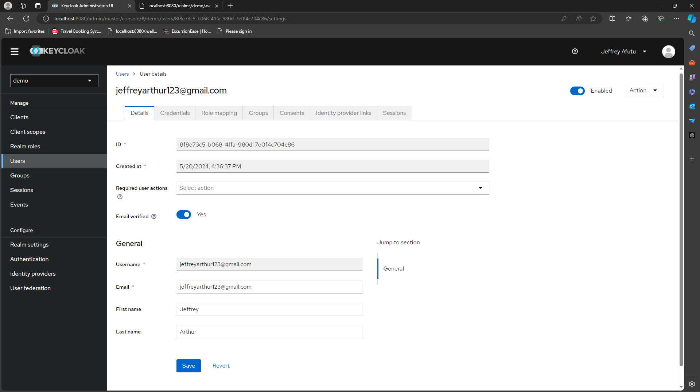
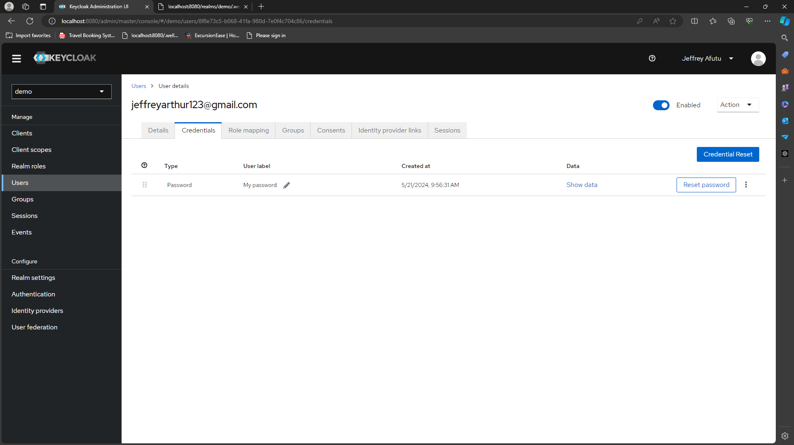
#### USER REGISTRATION
- In the `Realm Settings`, configure the login tab as below to allow user registration, password reset, remember me, email as username and email verification.
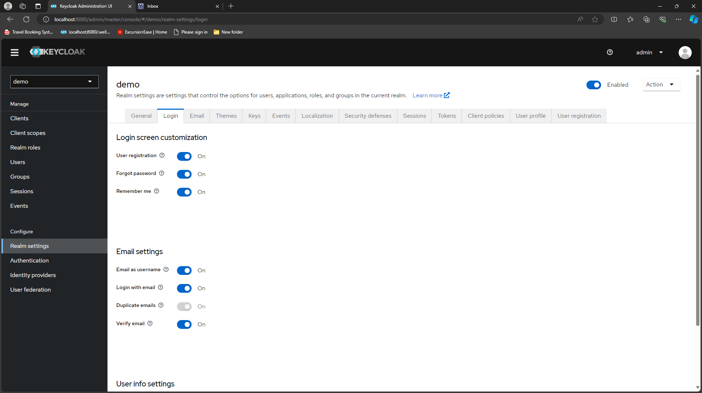
- Configure admin credentials (email, first name and last name)
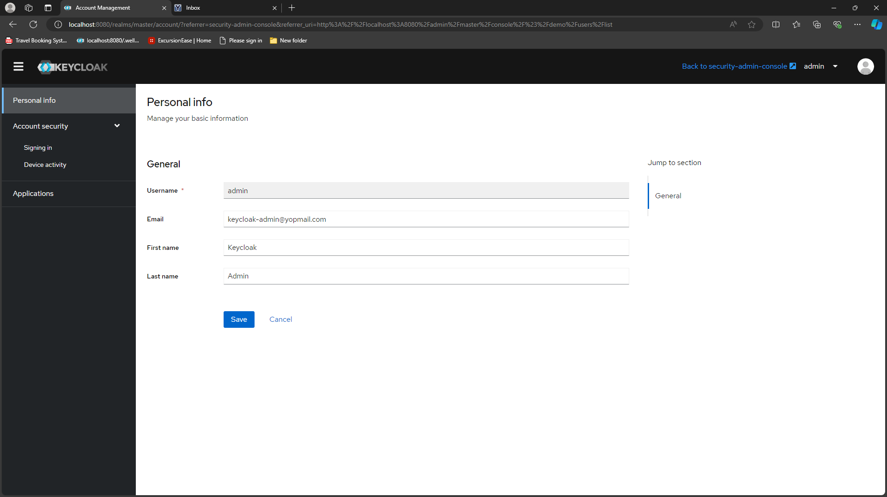
- In the `Realm Settings`, configure the email tab as below to send email for verification, password reset etc.
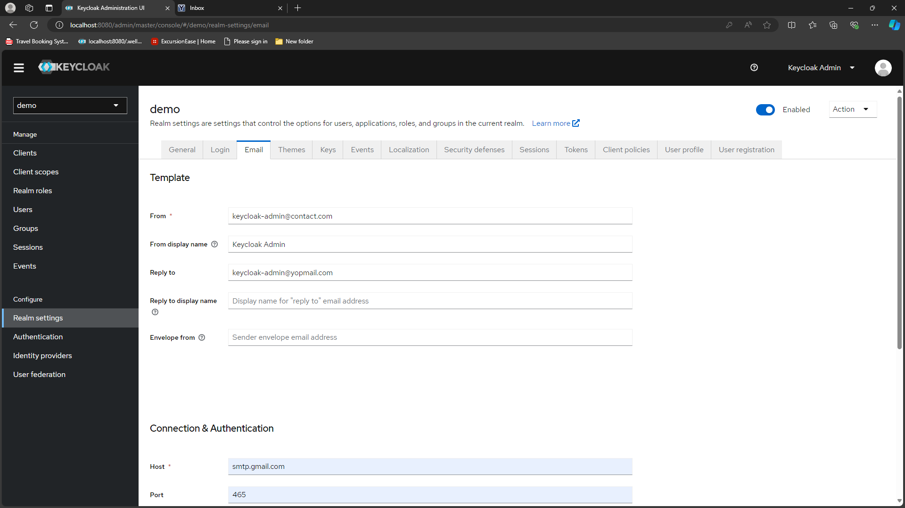
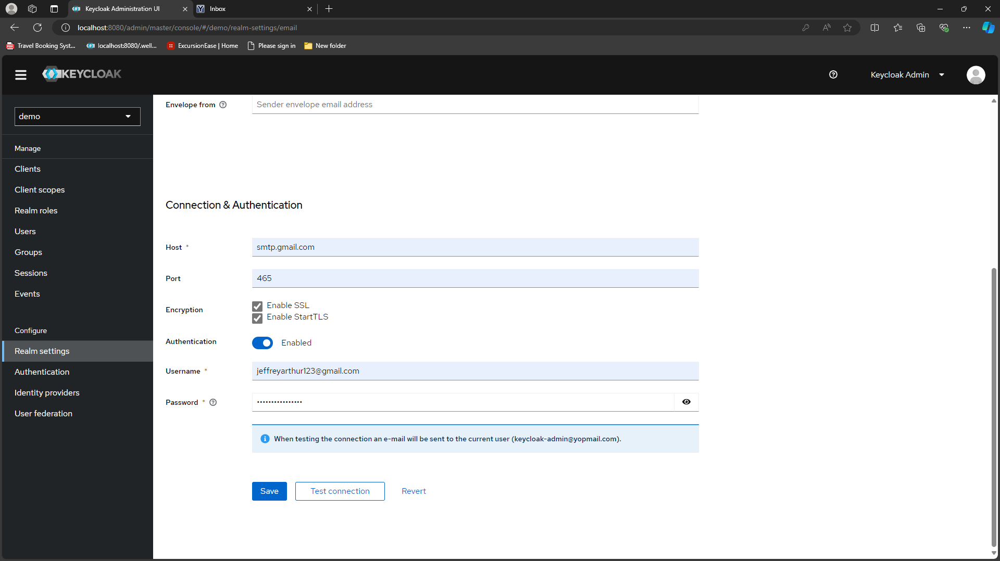

#### IDENTIFY PROVIDERS CONFIGURATION
- Add github or google as an identity provider
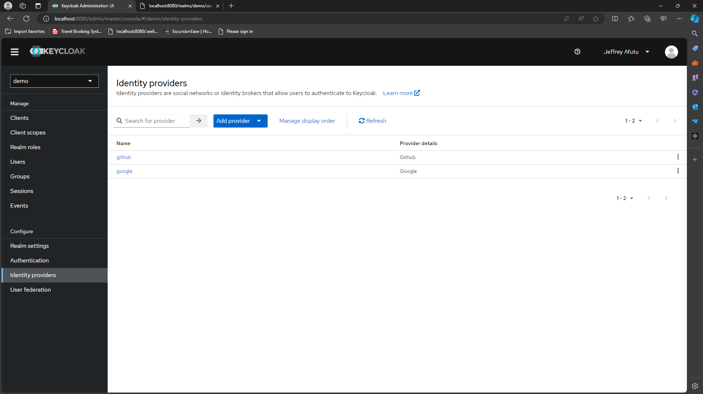
  - Ensure when creating oauth app in github or google, use the redirect uri provided by keycloak 
  - After creating the oauth app, provide the client id and client secret to your keycloak
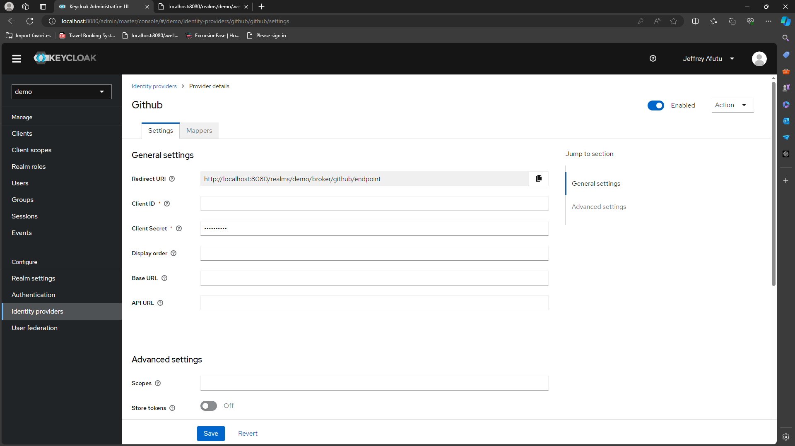
- Access your configuration endpoints at `http://localhost:8080/realms/demo/.well-known/openid-configuration`
  For further information on creating realms and client checkout [Keycloak instructions](https://www.keycloak.org/getting-started/getting-started-docker
